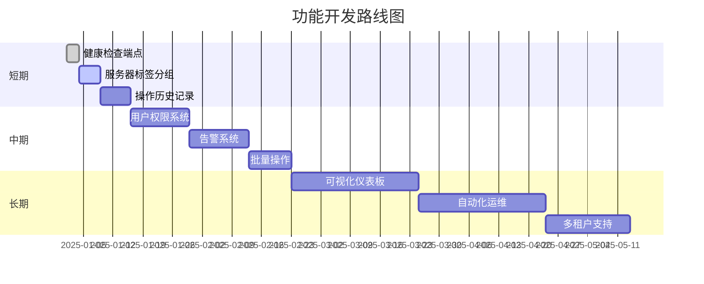

# IPvtl Cluster Web Management - 项目分析与优化建议

**文档版本：** v1.0  
**最后更新：** 2025-12-24  
**维护说明：** 本文档将持续更新，记录项目分析、优化建议及实施进展

---

## 目录

1. [项目概述](#1-项目概述)
2. [架构分析](#2-架构分析)
3. [代码质量评估](#3-代码质量评估)
4. [安全性分析](#4-安全性分析)
5. [性能优化建议](#5-性能优化建议)
6. [可维护性改进](#6-可维护性改进)
7. [功能扩展建议](#7-功能扩展建议)
8. [测试策略](#8-测试策略)
9. [部署与运维](#9-部署与运维)
10. [优先级路线图](#10-优先级路线图)
11. [变更历史](#11-变更历史)

---

## 1. 项目概述

### 1.1 项目定位
IPvtl Cluster Web Management 是一个轻量级的集群管理面板，用于监控和管理多台 IPVTL 服务器及其通道状态。

### 1.2 技术栈
- **后端**: FastAPI (Python 3.x)
- **前端**: 原生 HTML/CSS/JavaScript（单页应用）
- **HTTP 客户端**: httpx（异步）
- **配置管理**: Pydantic Settings
- **数据存储**: JSON 文件配置（servers.json）

### 1.3 核心功能
1. **服务器发现**: 从配置文件加载服务器列表
2. **状态轮询**: 周期性获取服务器 CPU 和通道状态
3. **通道管理**: 支持通道的重启操作
4. **Web 界面**: 提供实时监控和操作界面

### 1.4 项目优势
- ✅ 代码结构清晰，职责分离良好
- ✅ 使用现代异步框架（FastAPI + httpx）
- ✅ 配置灵活，支持环境变量覆盖
- ✅ 前端界面简洁直观
- ✅ 完全由 AI 工具构建，代码规范统一

---

## 2. 架构分析

### 2.1 整体架构图

```
┌─────────────────────────────────────────────────┐
│                  浏览器客户端                      │
│              (frontend/index.html)              │
└────────────────────┬────────────────────────────┘
                     │ HTTP/REST API
                     ▼
┌─────────────────────────────────────────────────┐
│              FastAPI 应用层                       │
│              (app/main.py)                      │
├─────────────────────────────────────────────────┤
│  API 路由层 (app/api/servers.py)                 │
│  - GET /api/servers                             │
│  - GET /api/servers/{id}/status                 │
│  - POST /api/servers/{id}/channels/{id}/restart │
└────────┬────────────────────────┬────────────────┘
         │                        │
         ▼                        ▼
┌────────────────┐      ┌──────────────────┐
│  Poller 服务    │      │  Manager 服务     │
│  (轮询器)       │      │  (通道控制)       │
│  - 并发轮询     │      │  - 停止通道       │
│  - 状态缓存     │      │  - 启动通道       │
└────────┬───────┘      └────────┬─────────┘
         │                        │
         │ HTTP GET               │ HTTP GET
         ▼                        ▼
┌─────────────────────────────────────────────────┐
│          目标 IPVTL 服务器集群                     │
│    (配置在 servers/servers.json)                 │
└─────────────────────────────────────────────────┘
```

### 2.2 目录结构分析

```
IPvtl-Cluster-Web-Management/
├── app/
│   ├── __init__.py
│   ├── main.py              # 应用入口，启动配置
│   ├── config.py            # 全局配置管理
│   ├── models.py            # 数据模型定义
│   ├── api/
│   │   ├── __init__.py
│   │   └── servers.py       # API 路由实现
│   └── services/
│       ├── __init__.py
│       ├── poller.py        # 轮询服务实现
│       └── manager.py       # 通道管理实现
├── frontend/
│   └── index.html           # 前端单页应用
├── servers/
│   └── servers.json         # 服务器配置文件
├── requirements.txt         # Python 依赖
├── start.bat               # Windows 启动脚本
└── README.md               # 项目文档
```

**评价**: ✅ 结构清晰，符合 FastAPI 最佳实践，分层合理

### 2.3 数据流分析

#### 2.3.1 状态轮询流程
```
启动时 → 加载 servers.json → 创建 Poller 实例 → 启动后台轮询任务
                                                    ↓
                            ┌───────────────────────┘
                            ▼
                    并发请求各服务器 /status
                            ↓
                    解析 JSON 响应
                            ↓
                    更新内存缓存 (_statuses)
                            ↓
                    等待 POLL_INTERVAL 秒
                            ↓
                    循环执行直到停止信号
```

#### 2.3.2 API 请求流程
```
前端请求 → FastAPI 路由 → 从 Poller 获取缓存状态 → 返回 JSON
```

#### 2.3.3 通道重启流程
```
前端 POST → API 验证服务器 → Manager.restart_channel
                                ↓
                        发送 stop 请求
                                ↓
                        等待 0.5 秒
                                ↓
                        发送 start 请求
                                ↓
                        返回操作结果
```

### 2.4 关键技术决策

| 决策 | 优势 | 潜在问题 |
|------|------|----------|
| 使用内存缓存状态 | 快速响应，减少请求压力 | ⚠️ 重启后数据丢失，无历史记录 |
| 配置文件存储服务器列表 | 简单直接，易于修改 | ⚠️ 无运行时动态更新能力 |
| 前端原生实现 | 无构建工具依赖，部署简单 | ⚠️ 代码可维护性随功能增加而下降 |
| 使用 print() 输出日志 | 开发调试方便 | ⚠️ 生产环境不可控，缺乏日志级别 |

---

## 3. 代码质量评估

### 3.1 优点

#### 3.1.1 代码组织
- ✅ **清晰的模块划分**: API、服务、模型分离明确
- ✅ **依赖注入**: 通过 `app.state.poller` 共享 Poller 实例
- ✅ **类型提示**: 使用 Pydantic 模型确保类型安全
- ✅ **异步优先**: 全面使用 `async/await` 模式

#### 3.1.2 异步处理
```python
# 示例：并发轮询实现
tasks = [self._fetch(s) for s in self.servers]
await asyncio.gather(*tasks)
```
- ✅ 使用 `asyncio.Semaphore` 控制并发数
- ✅ 正确使用 `asyncio.gather` 并发执行任务

#### 3.1.3 错误处理
```python
try:
    # 请求逻辑
except Exception as e:
    print(f"Error: {e}")
    self._statuses[server.id] = ServerStatus(id=server.id, cpu=0.0, channels=[])
```
- ✅ 异常捕获后提供降级数据，避免 API 404

### 3.2 需要改进的地方

#### 3.2.1 🔴 高优先级问题

**问题 1: 配置不一致性** ✅ **已修复**
```python
# app/main.py - 启动时加载一次
servers = load_servers_from_config()
app.state.poller = Poller(servers)

# app/api/servers.py - 每次请求重新加载
def load_servers() -> List[Server]:
    with open(settings.SERVERS_CONFIG_PATH, "r", encoding="utf-8") as f:
        ...
```
- ⚠️ **问题**: Poller 使用启动时的服务器列表，API 使用实时文件内容
- 🔧 **影响**: 修改 servers.json 后，Poller 不会自动更新
- ✅ **解决方案**: 
  1. 统一配置源：所有 API 端点从 `poller.servers` 获取服务器列表
  2. 添加 `reload_servers()` 方法支持热更新
  3. 新增 `POST /api/servers/reload` 端点允许运行时重载配置
  4. 使用 `asyncio.Lock` 保证线程安全

**问题 2: 缺乏日志系统** ✅ **已修复**
```python
print(f"Fetching status from {url}")  # 遍布代码的 print 语句
```
- ⚠️ **问题**: 无法控制日志级别和输出格式
- 🔧 **影响**: 生产环境难以调试和监控
- ✅ **解决方案**: 
  1. 创建 `app/logging_config.py` 统一日志配置
  2. 使用 Python 标准 `logging` 模块
  3. 支持从环境变量 `LOG_LEVEL` 读取日志级别
  4. 替换所有 `print()` 语句为适当级别的 logger 调用
  5. 日志格式包含时间戳、模块名、级别、消息

**问题 3: 无认证机制** ✅ **已修复**
```python
app.add_middleware(
    CORSMiddleware,
    allow_origins=["*"],  # 允许所有来源
    ...
)
```
- ⚠️ **问题**: API 完全开放，无访问控制
- 🔧 **影响**: 任何人都可以调用重启接口
- ✅ **解决方案**: 
  1. 添加 `app/security.py` 实现 API Key 认证
  2. 在 `app/config.py` 添加 `API_KEY_ENABLED` 和 `API_KEY` 配置项
  3. 为敏感操作端点添加认证依赖
  4. 默认禁用认证，保持向后兼容
  5. 在 README.md 中添加认证使用说明

#### 3.2.2 🟡 中优先级问题

**问题 4: 硬编码的等待时间** ✅ **已修复**
```python
await asyncio.sleep(0.5)  # 在 restart_channel 中硬编码
```
- ✅ **解决方案**: 添加 `RESTART_DELAY_SECONDS` 配置项到 `app/config.py`

**问题 5: 错误处理过于宽泛** ✅ **已修复**
```python
except Exception as e:  # 捕获所有异常
```
- ✅ **解决方案**: 
  1. 创建 `app/exceptions.py` 定义自定义异常类
  2. 区分具体异常类型（`httpx.TimeoutException`、`httpx.HTTPError`、`json.JSONDecodeError`）
  3. 在 `app/main.py` 添加全局异常处理器
  4. 记录详细的错误信息到日志

**问题 6: 缺乏输入验证** ✅ **已修复**
```python
@router.post("/api/servers/{server_id}/channels/{channel_id}/restart")
async def post_restart_channel(server_id: str, channel_id: str):
    # 没有验证 channel_id 格式或是否存在
```
- ✅ **解决方案**: 
  1. 使用 `re.match(r'^[a-zA-Z0-9_-]+$', channel_id)` 验证格式
  2. 防止 URL 注入攻击
  3. 添加有意义的错误提示

#### 3.2.3 🟢 低优先级改进

**问题 7: 魔法数字**
```python
servers = servers[:settings.MAX_SERVERS]  # 切片限制
```
- 💡 **建议**: 虽已使用配置，但可增加日志说明截断情况

**问题 8: CPU 计算逻辑复杂**
```python
# poller.py 中计算平均值
cpu = sum(data.get("cpu", [])) / len(data.get("cpu", [])) if data.get("cpu") else 0

# frontend 中也有类似逻辑
const sum = nums.reduce((a,b) => a + b, 0);
cpuPercent = sum / nums.length;
```
- 💡 **建议**: 后端统一处理，前端直接使用

### 3.3 代码复杂度分析

| 模块 | 行数 | 复杂度 | 评价 |
|------|------|--------|------|
| app/main.py | 54 | 低 | ✅ 清晰简洁 |
| app/config.py | 30 | 低 | ✅ 配置完整 |
| app/models.py | 23 | 低 | ✅ 模型简单 |
| app/api/servers.py | 61 | 中 | ⚠️ 建议拆分获取和重启逻辑 |
| app/services/poller.py | 79 | 中 | ⚠️ `_fetch` 方法可拆分 |
| app/services/manager.py | 40 | 低 | ✅ 职责单一 |
| frontend/index.html | 203 | 高 | ⚠️ 建议重构为组件化框架 |

---

## 4. 安全性分析

### 4.1 🔴 严重安全问题

#### 4.1.1 无身份验证
**当前状态:**
```python
# 所有 API 端点完全开放
@router.post("/api/servers/{server_id}/channels/{channel_id}/restart")
async def post_restart_channel(server_id: str, channel_id: str):
    # 无任何认证检查
```

**风险等级:** 🔴 严重  
**影响:** 攻击者可以随意重启任何通道，造成服务中断

**修复方案:**
```python
from fastapi import Depends, HTTPException, Security
from fastapi.security import APIKeyHeader

API_KEY = "your-secret-key-here"  # 应从环境变量读取
api_key_header = APIKeyHeader(name="X-API-Key")

def verify_api_key(api_key: str = Security(api_key_header)):
    if api_key != API_KEY:
        raise HTTPException(status_code=403, detail="Invalid API Key")
    return api_key

@router.post("...", dependencies=[Depends(verify_api_key)])
async def post_restart_channel(...):
    ...
```

#### 4.1.2 CORS 完全开放
```python
allow_origins=["*"]  # 允许任何域访问
```

**风险等级:** 🟡 中等  
**影响:** CSRF 攻击风险

**修复方案:**
```python
allow_origins=[
    "http://localhost:8000",
    "https://yourdomain.com"
]
```

#### 4.1.3 缺乏请求速率限制
**风险:** API 滥用、DDoS 攻击

**修复方案:** 使用 `slowapi` 库
```python
from slowapi import Limiter
from slowapi.util import get_remote_address

limiter = Limiter(key_func=get_remote_address)
app.state.limiter = limiter

@router.post("...")
@limiter.limit("5/minute")
async def post_restart_channel(...):
    ...
```

### 4.2 🟡 潜在安全隐患

#### 4.2.1 输入验证不足
```python
# channel_id 直接拼接到 URL
url = f"http://{server.host}:{server.port}/channel{channel_id}?stop"
```

**风险:** URL 注入攻击

**修复方案:**
```python
from urllib.parse import quote

channel_id = quote(channel_id, safe='')
url = f"http://{server.host}:{server.port}/channel{channel_id}?stop"
```

#### 4.2.2 敏感信息可能暴露
```python
print(f"Response from {url}: {data}")  # 可能包含敏感数据
```

**修复方案:** 使用日志库并配置敏感字段过滤

#### 4.2.3 依赖版本不固定
```python
# requirements.txt
fastapi>=0.95.0  # 只指定最低版本
```

**风险:** 可能引入有漏洞的新版本

**修复方案:**
```python
fastapi==0.104.1  # 固定版本
# 或使用 requirements-lock.txt
```

### 4.3 安全检查清单

- [ ] 实现 API 认证机制
- [ ] 限制 CORS 允许的域
- [ ] 添加请求速率限制
- [ ] 实现输入验证和清理
- [ ] 使用环境变量存储敏感配置
- [ ] 添加 HTTPS 支持
- [ ] 实现审计日志记录关键操作
- [ ] 定期更新依赖并检查漏洞
- [ ] 添加请求大小限制
- [ ] 实现 IP 白名单（可选）

---

## 5. 性能优化建议

### 5.1 当前性能特征

#### 5.1.1 优势
- ✅ 异步 I/O，高并发处理能力
- ✅ 内存缓存状态，响应快速
- ✅ 并发控制（Semaphore），避免资源耗尽

#### 5.1.2 性能瓶颈分析

| 场景 | 当前表现 | 瓶颈 |
|------|----------|------|
| 100 台服务器轮询 | ~5-10 秒/轮 | 串行 gather，受最慢服务器影响 |
| API 状态查询 | <10ms | ✅ 内存读取，无瓶颈 |
| 通道重启 | 10-20 秒 | stop/start 串行 + 固定延迟 |
| 前端自动刷新 | 持续 HTTP 轮询 | 浪费带宽，无变化时也刷新 |

### 5.2 🎯 优化建议

#### 5.2.1 轮询器优化

**优化 1: 超时独立处理**
```python
# 当前：一个服务器超时会阻塞整体
await asyncio.gather(*tasks)

# 建议：允许部分失败
results = await asyncio.gather(*tasks, return_exceptions=True)
for i, result in enumerate(results):
    if isinstance(result, Exception):
        logger.warning(f"Server {servers[i].id} failed: {result}")
```

**优化 2: 智能轮询间隔**
```python
# 根据服务器响应时间动态调整
if response_time < 1.0:
    next_interval = POLL_INTERVAL
else:
    next_interval = POLL_INTERVAL * 1.5  # 慢速服务器降频
```

**优化 3: 增量更新**
```python
# 仅当状态变化时更新前端
def has_status_changed(old, new):
    return old.cpu != new.cpu or old.channels != new.channels
```

#### 5.2.2 API 优化

**优化 4: 批量状态接口**
```python
@router.get("/api/servers/status/batch")
async def get_batch_status(request: Request, server_ids: List[str] = Query(...)):
    poller = request.app.state.poller
    statuses = {sid: poller.get_status(sid) for sid in server_ids}
    return statuses
```

**优化 5: 缓存控制头**
```python
@router.get("/api/servers")
async def get_servers(response: Response):
    response.headers["Cache-Control"] = "public, max-age=60"
    # 服务器列表不常变，允许浏览器缓存
    ...
```

#### 5.2.3 前端优化

**优化 6: WebSocket 替代轮询**
```python
# 后端增加 WebSocket 端点
from fastapi import WebSocket

@app.websocket("/ws/status")
async def websocket_status(websocket: WebSocket):
    await websocket.accept()
    while True:
        # 推送状态变化
        await websocket.send_json(...)
        await asyncio.sleep(POLL_INTERVAL)
```

**优化 7: 虚拟滚动**
```javascript
// 对于大量服务器，只渲染可见部分
// 使用库如 virtual-scroller
```

**优化 8: 防抖动**
```javascript
// 重启按钮防重复点击
let isRestarting = false;
async function restart(serverId, channelId) {
    if (isRestarting) return;
    isRestarting = true;
    try {
        await fetch(...);
    } finally {
        isRestarting = false;
    }
}
```

#### 5.2.4 数据库层（未来扩展）

**优化 9: 引入时序数据库**
```
建议使用 InfluxDB 或 TimescaleDB 存储历史状态
- 支持查询趋势
- 生成性能报表
- 异常检测
```

### 5.3 性能监控建议

**添加指标收集**
```python
# 使用 Prometheus 客户端
from prometheus_client import Counter, Histogram

api_requests = Counter('api_requests_total', 'Total API requests')
poll_duration = Histogram('poll_duration_seconds', 'Poller duration')

@router.get("/api/servers")
async def get_servers():
    api_requests.inc()
    ...
```

### 5.4 预期收益

| 优化项 | 实施难度 | 预期提升 | 优先级 |
|--------|----------|----------|--------|
| 超时独立处理 | 低 | 轮询稳定性 +50% | 🔴 高 |
| 批量状态接口 | 低 | 前端加载速度 +30% | 🟡 中 |
| WebSocket 推送 | 中 | 实时性 +80%，带宽 -60% | 🟢 低 |
| 时序数据库 | 高 | 新增历史分析能力 | 🟢 低 |

---

## 6. 可维护性改进

### 6.1 日志系统重构

#### 6.1.1 🔧 实施方案

**步骤 1: 创建日志配置**
```python
# app/logging_config.py
import logging
from app.config import settings

def setup_logging():
    level = getattr(logging, settings.LOG_LEVEL.upper())
    logging.basicConfig(
        level=level,
        format='%(asctime)s - %(name)s - %(levelname)s - %(message)s',
        handlers=[
            logging.StreamHandler(),
            logging.FileHandler('logs/app.log')
        ]
    )

logger = logging.getLogger('ipvtl_cluster')
```

**步骤 2: 替换所有 print 语句**
```python
# 修改前
print(f"Fetching status from {url}")

# 修改后
logger.info(f"Fetching status from {url}", extra={
    'server_id': server.id,
    'url': url
})
```

**步骤 3: 结构化日志**
```python
import json

logger.info(json.dumps({
    'event': 'fetch_status',
    'server_id': server.id,
    'url': url,
    'response_time_ms': duration
}))
```

### 6.2 配置管理增强

#### 6.2.1 配置分环境
```python
# app/config.py
class Settings(BaseSettings):
    ENV: str = "development"  # development, staging, production
    
    @property
    def is_production(self):
        return self.ENV == "production"
    
    class Config:
        env_file = f".env.{ENV}"  # .env.development, .env.production
```

#### 6.2.2 配置验证
```python
from pydantic import validator

class Settings(BaseSettings):
    POLL_INTERVAL: int = 10
    
    @validator('POLL_INTERVAL')
    def validate_interval(cls, v):
        if v < 1 or v > 3600:
            raise ValueError('POLL_INTERVAL must be between 1 and 3600')
        return v
```

### 6.3 错误处理标准化

#### 6.3.1 自定义异常类
```python
# app/exceptions.py
class IPvtlException(Exception):
    """基础异常类"""
    pass

class ServerNotFoundException(IPvtlException):
    """服务器未找到"""
    pass

class ChannelRestartException(IPvtlException):
    """通道重启失败"""
    pass
```

#### 6.3.2 全局异常处理器
```python
# app/main.py
from fastapi import Request
from fastapi.responses import JSONResponse

@app.exception_handler(ServerNotFoundException)
async def server_not_found_handler(request: Request, exc: ServerNotFoundException):
    return JSONResponse(
        status_code=404,
        content={"error": "server_not_found", "message": str(exc)}
    )
```

### 6.4 代码复用与模块化

#### 6.4.1 提取公共函数
```python
# app/utils/http.py
async def fetch_with_retry(url: str, retries: int = 3):
    """带重试的 HTTP 请求"""
    for attempt in range(retries):
        try:
            async with httpx.AsyncClient() as client:
                return await client.get(url)
        except httpx.HTTPError:
            if attempt == retries - 1:
                raise
            await asyncio.sleep(2 ** attempt)
```

#### 6.4.2 服务接口抽象
```python
# app/services/base.py
from abc import ABC, abstractmethod

class StatusProvider(ABC):
    @abstractmethod
    async def get_status(self, server_id: str):
        pass

class Poller(StatusProvider):
    async def get_status(self, server_id: str):
        return self._statuses.get(server_id)
```

### 6.5 文档改进

#### 6.5.1 API 文档增强
```python
@router.post(
    "/api/servers/{server_id}/channels/{channel_id}/restart",
    summary="重启指定通道",
    description="先停止通道，等待 0.5 秒后启动",
    responses={
        200: {"description": "重启成功"},
        404: {"description": "服务器或通道不存在"},
        500: {"description": "重启失败"}
    }
)
async def post_restart_channel(
    server_id: str = Path(..., description="服务器 ID"),
    channel_id: str = Path(..., description="通道 ID")
):
    ...
```

#### 6.5.2 代码注释规范
```python
def calculate_average_cpu(cpu_data: Union[float, List[float]]) -> float:
    """
    计算 CPU 平均使用率
    
    Args:
        cpu_data: CPU 数据，可以是单个数值或多核数组
    
    Returns:
        平均 CPU 使用率（百分比）
    
    Examples:
        >>> calculate_average_cpu(50.0)
        50.0
        >>> calculate_average_cpu([30.0, 40.0, 50.0])
        40.0
    """
    ...
```

### 6.6 依赖管理

#### 6.6.1 使用依赖锁文件
```bash
# 生成精确版本锁
pip freeze > requirements-lock.txt

# 开发依赖分离
# requirements-dev.txt
pytest>=7.0.0
black>=23.0.0
mypy>=1.0.0
```

#### 6.6.2 依赖检查自动化
```bash
# 添加到 CI/CD
pip install safety
safety check -r requirements.txt
```

---

## 7. 功能扩展建议

### 7.1 🚀 短期功能（1-2 周）

#### 7.1.1 健康检查端点
```python
@router.get("/health")
async def health_check():
    """系统健康状态检查"""
    return {
        "status": "healthy",
        "poller_running": app.state.poller._task is not None,
        "server_count": len(app.state.poller.servers),
        "last_poll": app.state.poller.last_poll_time
    }
```

#### 7.1.2 服务器标签/分组
```json
// servers.json
{
    "id": "1",
    "name": "Server 1",
    "host": "192.168.2.172",
    "port": 8888,
    "tags": ["production", "beijing", "primary"],
    "group": "cluster-1"
}
```

```python
@router.get("/api/servers")
async def get_servers(group: Optional[str] = None, tags: Optional[List[str]] = Query(None)):
    servers = load_servers()
    if group:
        servers = [s for s in servers if s.group == group]
    if tags:
        servers = [s for s in servers if any(t in s.tags for t in tags)]
    return servers
```

#### 7.1.3 操作历史记录
```python
# app/models.py
class OperationLog(BaseModel):
    timestamp: datetime
    operation: str  # "restart_channel", "add_server", etc.
    server_id: str
    channel_id: Optional[str]
    user: str
    result: str

# 存储到 SQLite
import sqlite3

def log_operation(op: OperationLog):
    conn = sqlite3.connect('logs/operations.db')
    # INSERT ...
```

### 7.2 🎯 中期功能（1-2 月）

#### 7.2.1 用户权限系统
```python
from enum import Enum

class Role(str, Enum):
    ADMIN = "admin"
    OPERATOR = "operator"
    VIEWER = "viewer"

class User(BaseModel):
    username: str
    role: Role

# 权限装饰器
def require_role(role: Role):
    def decorator(func):
        async def wrapper(*args, user: User = Depends(get_current_user), **kwargs):
            if user.role.value < role.value:
                raise HTTPException(403)
            return await func(*args, **kwargs)
        return wrapper
    return decorator

@router.post("...", dependencies=[Depends(require_role(Role.OPERATOR))])
```

#### 7.2.2 告警系统
```python
class AlertRule(BaseModel):
    id: str
    condition: str  # "cpu > 80"
    duration: int  # 持续秒数
    action: str  # "email", "webhook", "sms"
    recipients: List[str]

class AlertManager:
    async def check_alerts(self, status: ServerStatus):
        for rule in self.rules:
            if self.evaluate_condition(rule.condition, status):
                await self.trigger_alert(rule, status)
```

#### 7.2.3 批量操作
```python
@router.post("/api/servers/batch/restart")
async def batch_restart(
    server_ids: List[str],
    channel_ids: List[str]
):
    """批量重启多个通道"""
    tasks = [
        restart_channel(server, channel)
        for server in servers
        for channel in channels
    ]
    results = await asyncio.gather(*tasks, return_exceptions=True)
    return {"results": results}
```

### 7.3 🌟 长期功能（3-6 月）

#### 7.3.1 可视化仪表板
```
技术栈建议：
- 前端：Vue 3 + Vite + TypeScript
- 图表：ECharts / Chart.js
- UI 框架：Element Plus / Ant Design Vue

功能：
- 实时曲线图（CPU、内存、网络）
- 拓扑图（服务器关系）
- 热力图（集群状态）
- 自定义布局
```

#### 7.3.2 自动化运维
```python
class AutomationRule(BaseModel):
    trigger: str  # "cpu_high", "channel_failed"
    condition: dict
    actions: List[str]  # ["restart_channel", "send_alert"]

# 示例：CPU 过高自动重启
{
    "trigger": "cpu_high",
    "condition": {"cpu": ">80", "duration": 300},
    "actions": ["restart_channel:1", "send_alert:admin@example.com"]
}
```

#### 7.3.3 多租户支持
```python
class Tenant(BaseModel):
    id: str
    name: str
    servers: List[str]  # 允许访问的服务器 ID
    quota: dict  # 资源配额

# 路由增加租户隔离
@router.get("/api/servers")
async def get_servers(tenant: Tenant = Depends(get_current_tenant)):
    servers = load_servers()
    return [s for s in servers if s.id in tenant.servers]
```

### 7.4 功能路线图



---

## 8. 测试策略

### 8.1 当前测试状况

**问题:** ❌ 项目目前完全缺乏测试  
**风险:**
- 无法验证功能正确性
- 重构时容易引入 bug
- 难以保证代码质量

### 8.2 📋 测试框架搭建

#### 8.2.1 单元测试

**测试框架:** pytest + pytest-asyncio

**目录结构:**
```
tests/
├── __init__.py
├── conftest.py              # 测试配置和 fixtures
├── unit/
│   ├── test_models.py       # 模型验证测试
│   ├── test_config.py       # 配置加载测试
│   ├── test_poller.py       # 轮询器逻辑测试
│   └── test_manager.py      # 管理器逻辑测试
├── integration/
│   ├── test_api.py          # API 集成测试
│   └── test_workflow.py     # 完整流程测试
└── fixtures/
    └── servers_test.json    # 测试数据
```

**示例测试用例:**
```python
# tests/unit/test_poller.py
import pytest
from app.services.poller import Poller
from app.models import Server

@pytest.mark.asyncio
async def test_poller_fetch_success():
    """测试成功获取服务器状态"""
    servers = [Server(id="1", host="localhost", port=8888)]
    poller = Poller(servers)
    
    # Mock HTTP 响应
    with mock.patch('httpx.AsyncClient.get') as mock_get:
        mock_get.return_value.status_code = 200
        mock_get.return_value.json.return_value = {
            "cpu": [30.0, 40.0],
            "channels": [{"id": "1", "status": "running"}]
        }
        
        await poller._fetch(servers[0])
        status = poller.get_status("1")
        
        assert status is not None
        assert status.cpu == 35.0  # 平均值
        assert len(status.channels) == 1
```

#### 8.2.2 API 测试
```python
# tests/integration/test_api.py
from fastapi.testclient import TestClient
from app.main import app

client = TestClient(app)

def test_get_servers():
    """测试获取服务器列表"""
    response = client.get("/api/servers")
    assert response.status_code == 200
    data = response.json()
    assert isinstance(data, list)

def test_get_server_status():
    """测试获取服务器状态"""
    response = client.get("/api/servers/1/status")
    assert response.status_code == 200
    data = response.json()
    assert "cpu" in data
    assert "channels" in data

def test_restart_channel():
    """测试重启通道"""
    response = client.post("/api/servers/1/channels/1/restart")
    assert response.status_code == 200
    data = response.json()
    assert "stop" in data
    assert "start" in data
```

#### 8.2.3 Mock 外部依赖
```python
# tests/conftest.py
import pytest
from unittest.mock import AsyncMock

@pytest.fixture
def mock_httpx_client(monkeypatch):
    """Mock httpx.AsyncClient"""
    mock_client = AsyncMock()
    monkeypatch.setattr("httpx.AsyncClient", lambda: mock_client)
    return mock_client

@pytest.fixture
def mock_servers_config(tmp_path):
    """创建临时服务器配置"""
    config_file = tmp_path / "servers.json"
    config_file.write_text('[{"id":"1","host":"localhost","port":8888}]')
    return str(config_file)
```

### 8.3 测试覆盖率目标

| 模块 | 目标覆盖率 | 优先级 |
|------|-----------|--------|
| app/models.py | 100% | 🔴 高 |
| app/services/poller.py | 90% | 🔴 高 |
| app/services/manager.py | 90% | 🔴 高 |
| app/api/servers.py | 85% | 🟡 中 |
| app/main.py | 70% | 🟢 低 |

**生成覆盖率报告:**
```bash
pytest --cov=app --cov-report=html
# 查看 htmlcov/index.html
```

### 8.4 持续集成测试

#### 8.4.1 GitHub Actions 配置
```yaml
# .github/workflows/test.yml
name: Tests

on: [push, pull_request]

jobs:
  test:
    runs-on: ubuntu-latest
    steps:
      - uses: actions/checkout@v3
      - uses: actions/setup-python@v4
        with:
          python-version: '3.10'
      - name: Install dependencies
        run: |
          pip install -r requirements.txt
          pip install -r requirements-dev.txt
      - name: Run tests
        run: pytest --cov=app --cov-report=xml
      - name: Upload coverage
        uses: codecov/codecov-action@v3
```

### 8.5 性能测试

#### 8.5.1 压力测试
```python
# tests/performance/test_load.py
import asyncio
from locust import HttpUser, task, between

class APIUser(HttpUser):
    wait_time = between(1, 2)
    
    @task(3)
    def get_servers(self):
        self.client.get("/api/servers")
    
    @task(1)
    def get_status(self):
        self.client.get("/api/servers/1/status")

# 运行：locust -f tests/performance/test_load.py
```

#### 8.5.2 基准测试
```python
# 测试轮询性能
import time

async def benchmark_poller():
    poller = Poller(servers)
    start = time.time()
    await poller._fetch(servers[0])
    duration = time.time() - start
    assert duration < 1.0, f"Polling too slow: {duration}s"
```

---

## 9. 部署与运维

### 9.1 部署方案

#### 9.1.1 Docker 容器化

**Dockerfile**
```dockerfile
FROM python:3.10-slim

WORKDIR /app

# 安装依赖
COPY requirements.txt .
RUN pip install --no-cache-dir -r requirements.txt

# 复制应用代码
COPY app/ ./app/
COPY frontend/ ./frontend/
COPY servers/ ./servers/

# 暴露端口
EXPOSE 8000

# 健康检查
HEALTHCHECK --interval=30s --timeout=3s \
  CMD curl -f http://localhost:8000/health || exit 1

# 启动命令
CMD ["uvicorn", "app.main:app", "--host", "0.0.0.0", "--port", "8000"]
```

**docker-compose.yml**
```yaml
version: '3.8'

services:
  web:
    build: .
    ports:
      - "8000:8000"
    environment:
      - POLL_INTERVAL=10
      - LOG_LEVEL=info
    volumes:
      - ./servers:/app/servers:ro
      - ./logs:/app/logs
    restart: unless-stopped
    
  # 可选：添加 Nginx 反向代理
  nginx:
    image: nginx:alpine
    ports:
      - "80:80"
      - "443:443"
    volumes:
      - ./nginx.conf:/etc/nginx/nginx.conf:ro
      - ./ssl:/etc/nginx/ssl:ro
    depends_on:
      - web
```

#### 9.1.2 Kubernetes 部署

**deployment.yaml**
```yaml
apiVersion: apps/v1
kind: Deployment
metadata:
  name: ipvtl-management
spec:
  replicas: 2
  selector:
    matchLabels:
      app: ipvtl-management
  template:
    metadata:
      labels:
        app: ipvtl-management
    spec:
      containers:
      - name: web
        image: ipvtl-management:latest
        ports:
        - containerPort: 8000
        env:
        - name: POLL_INTERVAL
          value: "10"
        resources:
          limits:
            cpu: "500m"
            memory: "512Mi"
          requests:
            cpu: "250m"
            memory: "256Mi"
        livenessProbe:
          httpGet:
            path: /health
            port: 8000
          initialDelaySeconds: 10
          periodSeconds: 30
        readinessProbe:
          httpGet:
            path: /health
            port: 8000
          initialDelaySeconds: 5
          periodSeconds: 10
---
apiVersion: v1
kind: Service
metadata:
  name: ipvtl-management-service
spec:
  selector:
    app: ipvtl-management
  ports:
  - protocol: TCP
    port: 80
    targetPort: 8000
  type: LoadBalancer
```

### 9.2 监控与告警

#### 9.2.1 Prometheus 监控

**prometheus.yml**
```yaml
global:
  scrape_interval: 15s

scrape_configs:
  - job_name: 'ipvtl-management'
    static_configs:
      - targets: ['localhost:8000']
    metrics_path: '/metrics'
```

**添加 metrics 端点**
```python
# app/main.py
from prometheus_client import make_asgi_app

# 挂载 Prometheus metrics
metrics_app = make_asgi_app()
app.mount("/metrics", metrics_app)
```

#### 9.2.2 Grafana 仪表板

**关键指标:**
- API 请求速率和延迟
- 轮询成功率
- 服务器在线数量
- 通道状态分布
- CPU 使用率趋势

**示例 Prometheus 查询:**
```promql
# API 请求速率
rate(api_requests_total[5m])

# 轮询平均耗时
rate(poll_duration_seconds_sum[5m]) / rate(poll_duration_seconds_count[5m])

# 服务器离线数
count(server_status{status="offline"})
```

### 9.3 日志管理

#### 9.3.1 ELK Stack 集成

**Filebeat 配置**
```yaml
filebeat.inputs:
- type: log
  enabled: true
  paths:
    - /app/logs/*.log
  json.keys_under_root: true
  json.add_error_key: true

output.elasticsearch:
  hosts: ["elasticsearch:9200"]

setup.kibana:
  host: "kibana:5601"
```

#### 9.3.2 日志查询示例
```
Kibana 查询语言 (KQL):
- 查找错误: level:ERROR
- 特定服务器: server_id:"1"
- 慢请求: response_time_ms > 1000
```

### 9.4 备份与恢复

#### 9.4.1 配置文件备份
```bash
# 定时备份脚本
#!/bin/bash
DATE=$(date +%Y%m%d_%H%M%S)
BACKUP_DIR="/backup/ipvtl-management"

# 备份配置
cp servers/servers.json "$BACKUP_DIR/servers_$DATE.json"

# 备份数据库（如果有）
sqlite3 logs/operations.db ".backup '$BACKUP_DIR/operations_$DATE.db'"

# 保留最近 30 天的备份
find "$BACKUP_DIR" -mtime +30 -delete
```

#### 9.4.2 灾难恢复计划
```
1. 配置文件恢复
   - 从备份恢复 servers.json
   - 验证配置格式

2. 应用重启
   - 停止当前服务
   - 更新配置
   - 启动服务并验证健康检查

3. 数据恢复（如果引入数据库）
   - 恢复数据库文件
   - 运行数据验证脚本

恢复时间目标 (RTO): < 15 分钟
恢复点目标 (RPO): < 1 小时
```

### 9.5 升级策略

#### 9.5.1 滚动更新
```yaml
# Kubernetes 滚动更新配置
spec:
  strategy:
    type: RollingUpdate
    rollingUpdate:
      maxSurge: 1
      maxUnavailable: 0
```

#### 9.5.2 蓝绿部署
```bash
# 1. 部署新版本（绿）
kubectl apply -f deployment-green.yaml

# 2. 验证新版本健康
kubectl rollout status deployment/ipvtl-management-green

# 3. 切换流量
kubectl patch service ipvtl-management-service -p '{"spec":{"selector":{"version":"green"}}}'

# 4. 观察一段时间后删除旧版本（蓝）
kubectl delete deployment ipvtl-management-blue
```

### 9.6 运维检查清单

**日常巡检（每天）**
- [ ] 检查 API 健康状态
- [ ] 查看错误日志
- [ ] 验证轮询服务正常
- [ ] 检查磁盘空间

**周检（每周）**
- [ ] 查看性能趋势
- [ ] 审查慢查询日志
- [ ] 检查依赖更新
- [ ] 备份验证

**月检（每月）**
- [ ] 安全审计
- [ ] 容量规划评估
- [ ] 更新文档
- [ ] 灾难恢复演练

---

## 10. 优先级路线图

### 10.1 紧急修复（立即实施）

| 问题 | 影响 | 预计工时 | 负责人 |
|------|------|---------|--------|
| 🔴 添加 API 认证 | 安全风险高 | 4h | - |
| 🔴 实现日志系统 | 生产不可调试 | 3h | - |
| 🔴 修复配置不一致 | 功能缺陷 | 2h | - |

### 10.2 短期改进（1-2 周）

**第 1 周**
- [ ] 实现健康检查端点
- [ ] 添加请求速率限制
- [ ] 编写核心模块单元测试
- [ ] 创建 Docker 容器

**第 2 周**
- [ ] 限制 CORS 允许域
- [ ] 实现输入验证
- [ ] 添加操作审计日志
- [ ] 配置 CI/CD 流水线

### 10.3 中期规划（1-2 月）

**第 1 月**
- [ ] 用户权限系统
- [ ] 告警规则引擎
- [ ] 批量操作接口
- [ ] Prometheus 监控集成

**第 2 月**
- [ ] 服务器标签和分组
- [ ] WebSocket 实时推送
- [ ] 历史数据存储（时序数据库）
- [ ] Grafana 仪表板

### 10.4 长期愿景（3-6 月）

**第 3-4 月**
- [ ] Vue 3 前端重构
- [ ] 可视化拓扑图
- [ ] 自动化运维规则
- [ ] 性能优化（缓存、CDN）

**第 5-6 月**
- [ ] 多租户架构
- [ ] 插件系统
- [ ] 移动端适配
- [ ] 国际化支持

### 10.5 技术债务清单

| 技术债 | 现状 | 目标 | 优先级 |
|--------|------|------|--------|
| print() 调试 | 遍布代码 | 结构化日志 | 🔴 高 |
| 前端单文件 | 203 行 HTML | 组件化框架 | 🟡 中 |
| 无测试 | 0% 覆盖率 | >80% 覆盖率 | 🔴 高 |
| 配置不一致 | Poller 不热更新 | 统一配置源 | 🔴 高 |
| 硬编码值 | 0.5s 延迟 | 配置化 | 🟢 低 |

---

## 11. 变更历史

### v1.1 (2025-12-24)
**修复内容:**
- ✅ 实现结构化日志系统，替换所有 print() 语句
  - 创建 `app/logging_config.py` 统一日志配置
  - 支持从 `LOG_LEVEL` 环境变量控制日志级别
  - 日志格式包含时间戳、模块名、级别、消息
- ✅ 统一配置源，解决 Poller 与 API 配置不一致问题
  - API 端点从 `poller.servers` 获取服务器列表
  - 添加 `Poller.reload_servers()` 方法支持热更新
  - 新增 `POST /api/servers/reload` 端点
  - 使用 `asyncio.Lock` 保证线程安全
- ✅ 添加可选的 API Key 认证机制
  - 创建 `app/security.py` 实现认证逻辑
  - 配置项 `API_KEY_ENABLED` 和 `API_KEY`
  - 敏感端点（重启、重载）受保护
  - 默认禁用，保持向后兼容
- ✅ 提取硬编码配置项到 settings
  - 添加 `RESTART_DELAY_SECONDS` 配置项
- ✅ 改进异常处理，区分具体错误类型
  - 创建 `app/exceptions.py` 自定义异常类
  - 区分 `httpx.TimeoutException`、`httpx.HTTPError`、`json.JSONDecodeError`
  - 添加全局异常处理器
  - 详细的错误日志记录
- ✅ 添加输入验证防止注入攻击
  - 验证 `channel_id` 格式（正则表达式）
  - 提供有意义的错误提示
- ✅ 更新文档
  - README.md 添加 API 认证使用指南
  - 添加完整的配置参数表

**技术改进:**
- 代码质量提升：从 DEBUG 级日志到 ERROR 级错误处理
- 安全性增强：输入验证 + 可选认证
- 运维友好：支持热更新配置，无需重启

### v1.0 (2025-12-24)
**创建者:** AI Analysis  
**内容:**
- ✅ 完成项目全面分析
- ✅ 识别 23 个优化点
- ✅ 制定 3 阶段路线图
- ✅ 提供 85+ 代码示例

**后续维护计划:**
1. 每次重大功能开发后更新相应章节
2. 每月回顾并更新优先级路线图
3. 记录所有架构决策和权衡

---

## 附录

### A. 快速参考

**启动应用**
```bash
python start.bat  # Windows
uvicorn app.main:app --reload  # Unix/Linux
```

**运行测试**
```bash
pytest                          # 所有测试
pytest tests/unit/              # 单元测试
pytest --cov=app                # 覆盖率
```

**构建 Docker 镜像**
```bash
docker build -t ipvtl-management:latest .
docker-compose up -d
```

### B. 有用的资源

- **FastAPI 文档:** https://fastapi.tiangolo.com/
- **httpx 文档:** https://www.python-httpx.org/
- **Pydantic 文档:** https://docs.pydantic.dev/
- **pytest-asyncio:** https://pytest-asyncio.readthedocs.io/

### C. 贡献指南

**代码风格**
- 使用 Black 格式化: `black app/`
- 类型检查: `mypy app/`
- Lint: `flake8 app/`

**提交信息规范**
```
类型(范围): 简短描述

详细说明（可选）

关联问题：#123
```

类型：feat, fix, docs, style, refactor, test, chore

### D. 常见问题

**Q: 修改 servers.json 后为什么不生效？**  
A: 需要重启应用，或等待热更新功能实现（见路线图）

**Q: 如何增加轮询并发数？**  
A: 设置环境变量 `POLL_CONCURRENCY=20`

**Q: 如何启用 HTTPS？**  
A: 建议使用 Nginx 反向代理处理 SSL（见部署章节）

---

**文档结束**

如有疑问或建议，请提交 Issue 或 Pull Request。
